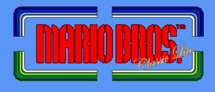
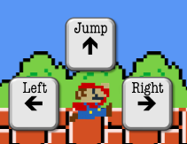

# Mario Bros. Classic Lite


A browser game inspired by Mario Bros and built in JavaScript and the HTML Canvas API.

## How to Play



1. Use the left and right arrow keys to move Mario.
2. Use the up arrow key to jump.
3. Avoid touching turtles (or it's Game Over)!
4. To kill turtles, hit the floor beneath them.
5. Have fun!

## Coordinates
Each object in the game keeps track of its own coordinates in order to provide real time collision detection.

```javascript
gameOver() {
  return ((PlusOrMinus(this.mario.marioX, 10, this.turtles.turtle1X).includes(this.turtles.turtle1X) &&
            (this.mario.marioY + 10 === this.turtles.turtle1Y || this.mario.marioY + 9 === this.turtles.turtle1Y) &&
            this.shouldDrawTurtle1) ||
          (PlusOrMinus(this.mario.marioX, 10, this.turtles.turtle2X).includes(this.turtles.turtle2X) &&
            (this.mario.marioY + 10 === this.turtles.turtle2Y || this.mario.marioY + 9 === this.turtles.turtle2Y) &&
            this.shouldDrawTurtle2) ||
          (PlusOrMinus(this.mario.marioX, 10, this.turtles.turtle3X).includes(this.turtles.turtle3X) &&
            (this.mario.marioY + 10 === this.turtles.turtle3Y || this.mario.marioY + 9 === this.turtles.turtle3Y) &&
            this.shouldDrawTurtle3));
}
```

## Event Handlers
Event handlers provide a seamless and responsive UI.

```javascript
addListeners() {
  document.addEventListener("keydown", this.keyDownHandler.bind(this), false);
  document.addEventListener("keyup", this.keyUpHandler.bind(this), false);
}
```

```javascript
keyDownHandler(e) {
  if (e.keyCode === 39) {
    this.rightPressed = true;
  } else if (e.keyCode === 37) {
    this.leftPressed = true;
  }

  if (!this.fired && e.keyCode === 38) {
    this.upPressed = true;
    this.fired = true;
  }
}

keyUpHandler(e) {
  if (e.keyCode === 39) {
    this.rightPressed = false;
  } else if (e.keyCode === 37) {
    this.leftPressed = false;
  }

  if (e.keyCode === 38) {
    this.upPressed = false;
    this.fired = false;
  }
}
```

## Tricky Implementation
A tricky feature to implement was Mario's interaction with the different floors that could be beneath him at any time. In order to deal with this, I made two functions in the Mario class: stopJump and fallDown.


### StopJump  
StopJump does exactly what it says (that's good naming convention for you!); it stops Mario's upwards motion based on his location.

```javascript
stopJump(initJump) {
  let jumpHeight = initJump;

  Object.keys(this.drawItems.platformCoords).map((platform) => {
    if ((this.marioY - this.drawItems.platformCoords[platform].yMax <= jumpHeight &&
        this.marioY > this.drawItems.platformCoords[platform].yMax &&
        this.marioY - jumpHeight <= this.drawItems.platformCoords[platform].yMax &&
        this.marioX + 20 <= this.drawItems.platformCoords[platform].xMax &&
        this.marioX >= this.drawItems.platformCoords[platform].xMin) || this.marioY - jumpHeight <= 0) {
      jumpHeight = this.marioY - 12 - this.drawItems.platformCoords[platform].yMax;
    }
  });

  if (this.marioY + jumpHeight < 0) {
    jumpHeight = this.marioY;
  }

  return jumpHeight;
}
```

### FallDown
FallDown stops Mario's downward motion based on the location of the different floors beneath him.

```javascript
fallDown() {
  let platformsMarioIsAbove = [];

  Object.keys(this.drawItems.platformCoords).map((platform) => {
    if (this.marioY < this.drawItems.platformCoords[platform].yMax &&
        this.marioX + 20 <= this.drawItems.platformCoords[platform].xMax &&
        this.marioX >= this.drawItems.platformCoords[platform].xMin) {
          platformsMarioIsAbove.push(platform);
    }
  });

  let nearestPlatform;
  let nearestPlatformY = 320;

  platformsMarioIsAbove.map((platform) => {
    if (nearestPlatformY > this.drawItems.platformCoords[platform].yMax) {
      nearestPlatformY = this.drawItems.platformCoords[platform].yMax;
      nearestPlatform = platform;
    }
  });

  if (nearestPlatformY > 262) {
    this.marioY = 262;
  } else {
    this.marioY = nearestPlatformY - 34;
  }

  return this.marioY;
}
```

## Future Features
In the future, I would like to implement a high score feature, a changing environment (floors moving when hit), and multi-step turtle killing (when hit a turtle flips at which point Mario must kick him).
